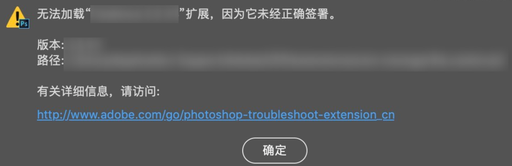

# YuzuMarker.Photoshop

YuzuMarker 对于 Photoshop 的交互开发了两套不同的实现，这两种实现都是官方支持的。这种实现是基于 Adobe 的 CEP 框架完成的，另外的使用 Adobe 的 COM 实现通讯的方案在主 repo 里：https://github.com/JeffersonQin/YuzuMarker

之所以在 COM 之外额外开发一套功能几乎相同的框架理由如下：

* 同时支持 Windows, MacOS (虽然好像并没有人会用 OSX 做嵌字, 而且我也不一定会适配)
* 好玩

## 开发方法

1. Clone 项目到本地
2. 运行 `npm install`
3. 将项目放置于 Adobe 支持的几种 CEP 插件路径中的一种内：
   > CEP supports 3 types of extension folders.
   > 
   > Product extension folder. Here is a suggestion, but each point product can decide where this folder should be. Third party extension can't be installed at this location.
   > * `${PP}/CEP/extensions` (PPs may use different folder.)
   > 
   > System extension folder
   > * Win(x86): `C:\Program Files\Common Files\Adobe\CEP\extensions`
   > * Win(x64): `C:\Program Files (x86)\Common Files\Adobe\CEP\extensions`, and `C:\Program Files\Common Files\Adobe\CEP\extensions` (since CEP 6.1)
   > * Mac: `/Library/Application Support/Adobe/CEP/extensions`
   > 
   > Per-user extension folder
   > * Win: `C:\Users\<USERNAME>\AppData\Roaming\Adobe\CEP/extensions`
   > * Mac: `~/Library/Application Support/Adobe/CEP/extensions`
4. 现在启用插件会有如下警告：
   
   * 对于 Windows：打开注册表路径 `HKEY_CURRENT_USER/Software/Adobe/` , 找到 `CSX.*` (具体多少视版本而定) , 新建 **字符串项** `PlayerDebugMode`, 数据设为 `1`
   * 对于 Mac: 
   ```
   [版本号]  : [需要执行的命令]
   CC 2014   : defaults write com.adobe.CSXS.5 PlayerDebugMode 1
   CC 2015   : defaults write com.adobe.CSXS.6 PlayerDebugMode 1
   CC 2015.5 : defaults write com.adobe.CSXS.7 PlayerDebugMode 1
   CC 2017   : defaults write com.adobe.CSXS.7 PlayerDebugMode 1
   CC 2018   : defaults write com.adobe.CSXS.8 PlayerDebugMode 1
   CC 2019   : defaults write com.adobe.CSXS.9 PlayerDebugMode 1
   CC 2021   : defaults write com.adobe.CSXS.10 PlayerDebugMode 1
   ```
5. Enjoy

## 原理

CEP 框架是基于 Chrome 的, 其可以包含 HTML / CSS 的内容，且可以使用 `node`，然后还可以调用自身的 API 和嵌入 ExtendScript，所以我使用的方案是在插件内搭建一个 HTTP Server，与外部软件通讯，内部功能代码使用 ExtendScript 书写，然后 JavaScript 封装调用。

```
Photoshop ⇔ ExtendScript
                 ||
			 JavaScript
			     ||
		   Node, HTTP Server
		   		 ||
				....
```

## HTTP Server API

* 默认端口：4016

TODO

## 一些参考资料

* https://github.com/Adobe-CEP/Getting-Started-guides
* https://github.com/Adobe-CEP/CEP-Resources
* https://github.com/ExtendScript/wiki
* https://wttech.blog/blog/2020/creating-custom-extension-for-adobe-photoshop/
